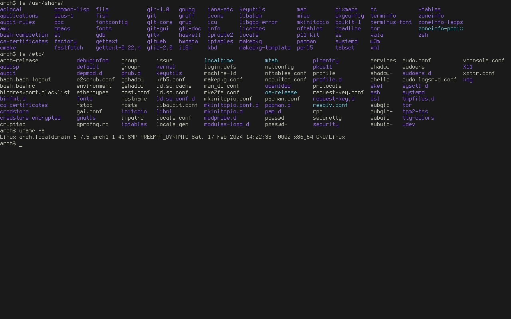
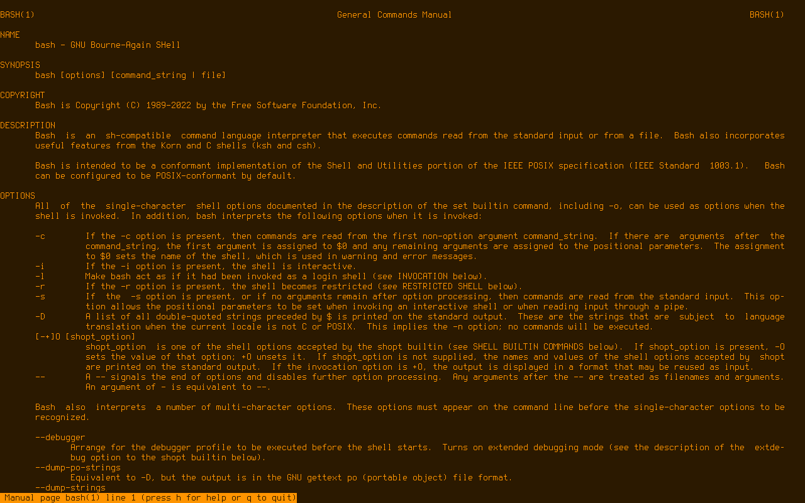
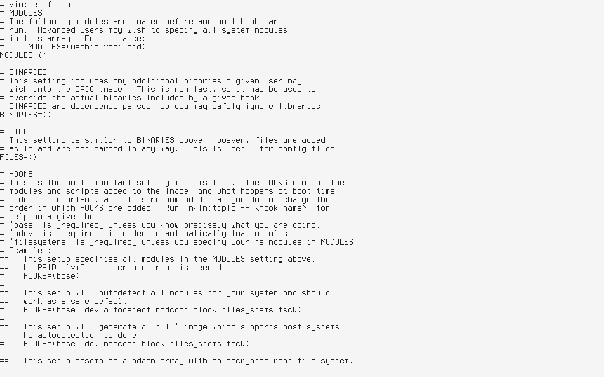

# Colorschemes for the linux TTY

## Installation

- `sudo ./install` to install `tty-colorscheme` and various themes.

- `sudo ./install remove` if you want to uninstall it.

## Usage

```
tty-colorscheme [-cfps | colorscheme]
  -c    list colorschemes
  -f    list psf fonts
  -p    print current palette
  -s    shift through colorschemes and fonts
```

To change colors for a current TTY at user log in add `tty-colorscheme [colorscheme]` to your `~/.profile`.

It requires using `sudo` if you want to change colors across all TTYs.

If you get screen artifacts hit `Ctrl+l` or type `clear`.

Type `reset` to get back to the system default colors.

## Screenshots

### monokai-soda



### mono-amber



### mono-light



### blood-dragon


## Customization

A colorscheme file looks like this:

```
color01="000000" # Black (Background)
color02="F44336" # Red
color03="4CAF50" # Green
color04="FFEB3B" # Yellow
color05="2196F3" # Blue
color06="9C27B0" # Magenta
color07="00BCD4" # Cyan
color08="9E9E9E" # White (Foreground)
color09="000000" # Black
color10="F44336" # Red
color11="4CAF50" # Green
color12="FFEB3B" # Yellow
color13="2196F3" # Blue
color14="9C27B0" # Magenta
color15="00BCD4" # Cyan
color16="9E9E9E" # White
```

Just change the hex values of colors and put it in `/etc/tty-colorscheme/colorschemes` directory.
