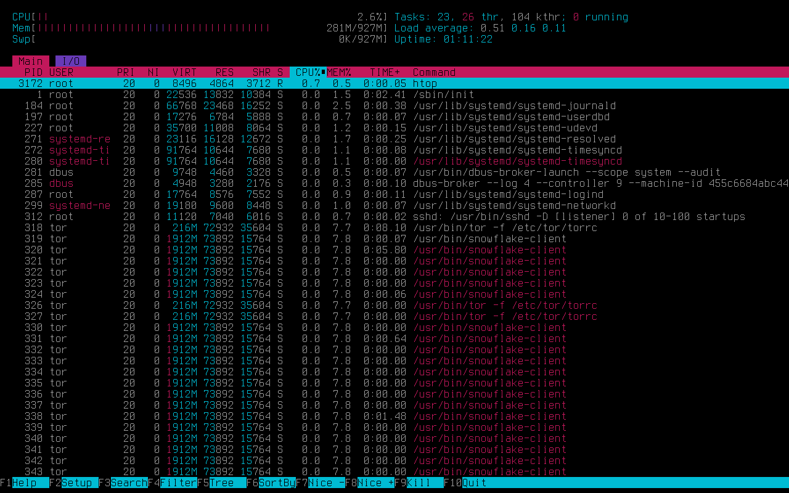
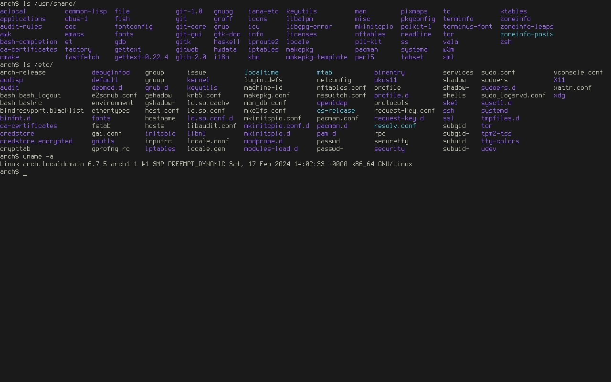
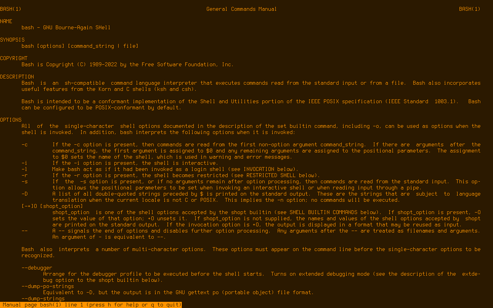

# Colorschemes for the linux TTY

## Installation

Run ```./install``` script as root to install ```tty-colorscheme``` and various themes

```./install remove``` if you want to uninstall it

### systemd

If you are using systemd it will also install ```tty-colorscheme.service``` which you can enable to change TTY colors on boot

A desired colorscheme can be set in ```/etc/tty-colorscheme/tty-colorscheme.conf```

## Usage

```
Usage: tty-colorscheme [flags | colorscheme]
  -l    list colorschemes
  -c    list colorschemes and print their colors
  -p    print current color palette
  -r    pick a random colorscheme
  -h    print help
```

To change colors for a current TTY at user logon add ```tty-colorscheme [colorscheme]``` to ```.profile```

It still requires using ```sudo``` if you want to change colors across all TTYs

If you get screen artifacts hit ```Ctrl+l``` or type ```clear```

Type ```reset``` to get back to the system default colors

```tty-colorscheme -c | less -R``` to scroll through schemes with colors printed, it's better to use ```reset``` before doing it to see proper colors

## Screenshots








## Customization

A colorscheme file looks like this

```
color1=000000  # Background
color2=F44336  # Red
color3=4CAF50  # Green
color4=FFEB3B  # Yellow
color5=2196F3  # Blue
color6=9C27B0  # Magenta
color7=00BCD4  # Cyan
color8=9E9E9E  # White
color9=000000  # Black
color10=F44336 # Red
color11=4CAF50 # Green
color12=FFEB3B # Yellow
color13=2196F3 # Blue
color14=9C27B0 # Magenta
color15=00BCD4 # Cyan
color16=9E9E9E # White
```

Just change the hex values of colors and put it in ```/etc/tty-colorscheme/colorschemes``` directory
